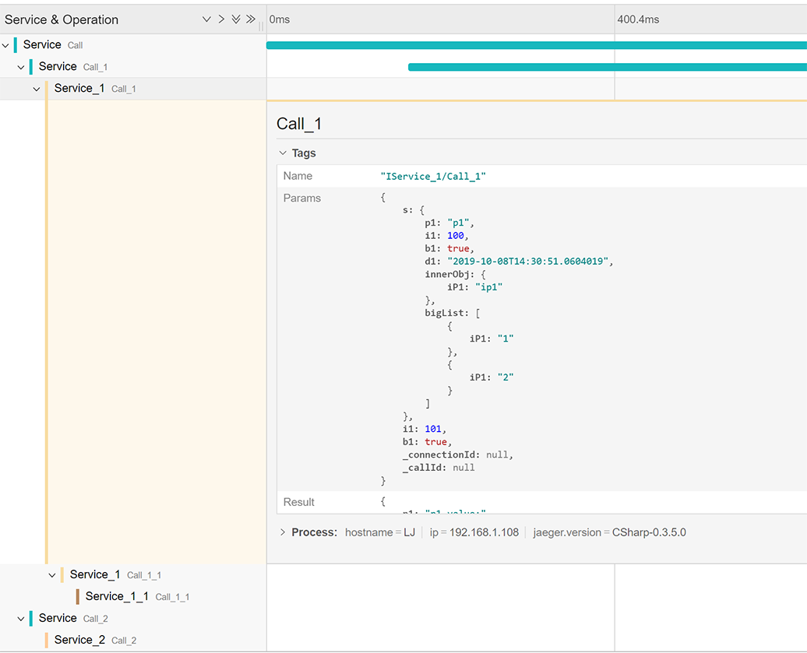

# NetRpc
[](https://www.nuget.org/packages/NetRpc/)
[](https://github.com/newshadowk/NetRpc/blob/master/LICENSE.md)

NetRpc is a light weight rpc engine base on **RabbitMQ**, **Grpc**, **Http** targeting .NET 5.0/6.0.  It use the simple interface to call each other, 
provide callback/cancel during invoking, so especially suitable for handle **long running call**.

## NuGet

NetRpc for **Grpc** channel can be installed in your project with the following command.
```
PM> Install-Package NetRpc.Grpc
```


NetRpc also supports **Http**, **RabbitMQ** channel following packages are available to install:
```
PM> Install-Package NetRpc.Http
PM> Install-Package NetRpc.RabbitMQ
```

Others install:

```
//Jeager tracing function.
PM> Install-Package NetRpc.Jeager

//Http channel for client only.
PM> Install-Package NetRpc.Http.Client
```

|Name|||
|-|-|-|
|[NetRpc.Grpc](https://www.nuget.org/packages/NetRpc.Grpc/) |[](https://www.nuget.org/packages/NetRpc.Grpc/)|[](https://www.nuget.org/packages/NetRpc.Grpc/)|
|[NetRpc.Http](https://www.nuget.org/packages/NetRpc.Http/) |[](https://www.nuget.org/packages/NetRpc.Http/)|[](https://www.nuget.org/packages/NetRpc.Http/)|
|[NetRpc.Http.Client](https://www.nuget.org/packages/NetRpc.Http.Client/) |[](https://www.nuget.org/packages/NetRpc.Http.Client/)|[](https://www.nuget.org/packages/NetRpc.Http.Client/)|
|[NetRpc.RabbitMQ](https://www.nuget.org/packages/NetRpc.RabbitMQ/) |[](https://www.nuget.org/packages/NetRpc.RabbitMQ/)|[](https://www.nuget.org/packages/NetRpc.RabbitMQ/)|
|[NetRpc.Jaeger](https://www.nuget.org/packages/NetRpc.Jaeger/) |[](https://www.nuget.org/packages/NetRpc.Jaeger/)|[](https://www.nuget.org/packages/NetRpc.Jaeger/)|

## Hello world

NetRpc for **Grpc** channel can be installed in your project with the following command.
```
PM> Install-Package NetRpc.Grpc
```

```c#
//service side
class Program
{
    static async Task Main(string[] args)
    {
        var host = Host.CreateDefaultBuilder()
            .ConfigureWebHostDefaults(webBuilder =>
            {
                webBuilder.ConfigureKestrel((_, options) =>
                    {
                        options.ListenAnyIP(50001, listenOptions => listenOptions.Protocols = HttpProtocols.Http2);
                    })
                    .ConfigureServices((_, services) =>
                    {
                        services.AddNGrpcService();
                        services.AddNServiceContract<IServiceAsync, ServiceAsync>();
                    }).Configure(app => { app.UseNGrpc(); });
            }).Build();

        await host.RunAsync();
    }
}

public class ServiceAsync : IServiceAsync
{
    public async Task<string> CallAsync(string s)
    {
        Console.WriteLine($"Receive: {s}");
        return "call ret";
    }
}
```
```c#
//client side
class Program
{
    static async Task Main(string[] args)
    {
        //register
        var services = new ServiceCollection();
        services.AddNGrpcClient(options => options.Url = "http://localhost:50001");
        services.AddNClientContract<IServiceAsync>();
        services.AddLogging();
        var buildServiceProvider = services.BuildServiceProvider();

        //get service
        var service = buildServiceProvider.GetService<IServiceAsync>();
        Console.WriteLine("call: hello world.");
        var ret = await service.CallAsync("hello world.");
        Console.WriteLine($"ret: {ret}");
    }
}
```
```c#
//datacontract is referenced by client and service
public interface IServiceAsync
{
    Task<string> CallAsync(string s);
}
```
Code here: [samples/HelloWorld](samples/HelloWorld).

Quick start: [QuickRef](QuickRef.md) 

## Overall
NetRpc provide **RabbitMQ**/**Grpc**/**Http** Channels to connect, each one has different advantages.
* **RabbitMQ** provide load balance, queue feature.
* **Grpc** use http2, provide all http2 advantages.
* **Http** use webapi, also provide swagger api.

All channels use uniform contract, so easily to switch channel without modify service implementation.


## RabbitMQ/Grpc
There is message channel for RabbitMQ and Grpc, Http pls see topic blow.


## Initialize by DI
There has two ways to initialize service and client, See DI sample below:
```c#
//service side
var host = Host.CreateDefaultBuilder()
    .ConfigureWebHostDefaults(webBuilder =>
    {
        webBuilder.ConfigureKestrel((context, options) =>
            {
                options.ListenAnyIP(50001, listenOptions => listenOptions.Protocols = HttpProtocols.Http2);
            })
            .ConfigureServices((context, services) =>
            {
                services.AddNGrpcService();
                services.AddNServiceContract<IServiceAsync, ServiceAsync>();
            }).Configure(app =>
            {
                app.UseNGrpc();
            });
    }).Build();
```
```c#
//client side
//register
ServiceCollection services = new ServiceCollection();
services.AddNGrpcClient(options => options.Url = "http://localhost:50001");
services.AddNClientContract<IServiceAsync>();
services.AddLogging();
var buildServiceProvider = services.BuildServiceProvider();

//get service
var service = buildServiceProvider.GetService<IServiceAsync>();
var clientProxy = buildServiceProvider.GetService<IClientProxy<IServiceAsync>>();

//call remote
await service.CallAsync("hello world.");
await clientProxy.Proxy.CallAsync("hello world.");
```
If want to inject multiple **ClientProxies**, should use **IClientProxyFactory**.
```c#
//service side
services.Configure<RabbitMQClientOptions>("mq1", context.Configuration.GetSection("Mq1"));
services.Configure<RabbitMQClientOptions>("mq2", context.Configuration.GetSection("Mq2"));
services.AddNRabbitMQClient();
services.AddNRpcClientContract<IService>();
```

```c#
//client side
public class MyHost : IHostedService
{
    private readonly IClientProxyFactory _factory;

    public MyHost(IClientProxyFactory factory)  //Get IClientProxyFactory here
    {
        _factory = factory;
    }

    public async Task StartAsync(CancellationToken cancellationToken)
    {
        var clientProxy = _factory.CreateProxy<IService>("grpc1");
...
```
## Serialization
RabbitMQ, Grpc channel base on **BinaryFormatter**, make sure all contract model mark as **[Serializable]**.  
```c#
[Serializable]
public class CustomObj
{
    //...
}
```
**[Important]** When returned Custom object contains a **Stream**:  
RabbitMQ, Grpc channel **Stream** mask as **[field: NonSerialized]**.  
Http channel **Stream** mask as **[JsonIgnore]**.  
```c#
Task<ComplexStream> GetComplexStreamAsync();

[Serializable]
public class ComplexStream
{
    [field: NonSerialized]       //add for RabbitMQ, Grpc channel
    [JsonIgnore]                 //add for http channel
    public Stream Stream { get; set; }

    public string OtherInfo { get; set; }
}
```
## Supported contract type
```c#
//Async
public interface IServiceAsync
{
    Task<CustomObj> SetAndGetObj(CustomObj obj);

    /// <exception cref="TaskCanceledException"></exception>
    Task CallByCancelAsync(CancellationToken token);

    Task CallByCallBackAsync(Func<CustomCallbackObj, Task> cb);

    /// <exception cref="NotImplementedException"></exception>
    Task CallBySystemExceptionAsync();

    /// <exception cref="CustomException"></exception>>
    Task CallByCustomExceptionAsync();

    Task<Stream> GetStreamAsync();

    Task SetStreamAsync(Stream data);

    Task<Stream> EchoStreamAsync(Stream data);

    Task<ComplexStream> GetComplexStreamAsync();

    /// <exception cref="TaskCanceledException"></exception>
    Task<ComplexStream> ComplexCallAsync(CustomObj obj, Stream data, Func<CustomCallbackObj, Task> cb, CancellationToken token);
}
```
## Sync/Async
NetRpc could use the both Sync/Async ways to defines the contract.
```c#
void Call();
Task CallAsync();

int GetValue();
Task<int> GetValueAsync();
```
## GenericType
Make sure the genericType in contract is mark as **[Serializable]**.
```c#
Task<T2> CallByGenericTypeAsync<T1, T2>(T1 obj);
```
## Header
Header is a type of **Dictionary<string, object>** object, mark sure your object mark as **[Serializable]**.  
Before call action, client set the **Header** which mark as **AsyncLocal** that guarantee muti-threads don`t influence each other.
```c#
//client side
_proxy.AdditionHeader.Add("k1", "header value");
_proxy.TestHeader();
```
Service can receive the header object which client sent.
```c#
//service side
public void TestHeader()
{
    var h = GlobalActionExecutingContext.Context.Header;
    //...
}
```
* **AdditionHeader**  
On the client side, when **AdditionHeader** is not null and items count is greater than 0, **Header** will get the value of **AdditionHeader** when call the remote. This feature is usefull when you want to transfer a sessionId to service.
```c#
//client side
//set the AdditionHeader with SessionId
client.Context.AdditionHeader = new Dictionary<string, object> {{"SessionId", 1}};
//will tranfer the header of SessionId to service.
client.Proxy.Call();
```
## ContractLifeTime
```c#
//Singleton: create one instance for every request.
services.AddNRpcContract<IService, Service>(ServiceLifetime.Singleton);

//Scoped: create new instance for each request. 
services.AddNRpcContract<IService, Service>(ServiceLifetime.Scoped);
```
## Context
On service side, **Midderware** or **Filter** can access **ActionExecutingContext**, it is

| Property           | Type | Description |
| :-----             | :--- | :---------- |
| Header             | Dictionary\<string object>  | Header sent from client. |
| Target             | object                      | Service instance of invoked action.|
| ChannelType        | ChannelType                 | Enum value: Undefined, Grpc, RabbitMQ, Http.|
| InstanceMethodInfo | MethodInfo                  | Current invoked method.  |
| ContractMethodInfo | MethodInfo                  | Current invoked contract method.  |
| ActionInfo         | ActionInfo                  | Warpped info of current invoked method.  |
| Args               | object[]                    | Args of invoked action.  |
| PureArgs           | object[]                    | Args of invoked action without stream and action.  |
| Callback           | Func\<object, Task>         | Callback of invoked action.  |
| Token              | CancellationToken           | CancellationToken of invoked action.  |
| Stream             | Stream                      | Stream of invoked action.  |
| ServiceProvider    | IServiceProvider            | ServiceProvider of invoked action.  |
| Contract           | Contract                    | Contract.|
| MethodObj          | MethodObj                   | MethodObj.|
| Result             | object                      | Result of invoked action.|
| Properties         | Dictionary\<object, object> | A central location for sharing state between components during the invoking process.  |

On client side, **Midderware** can access **ClientActionExecutingContext**, it is

| Property         | Type | Description |
| :-----           | :--- | :---------- |
| ServiceProvider  | IServiceProvider            | ServiceProvider of invoked action.  |
| Result           | object                      | Result of invoked action.|
| Header           | Dictionary\<string object>  | Header sent from client. |
| OptionsName      | string                      | Config options name by DI. |
| MethodInfo       | MethodInfo                  | Current invoked method.  |
| Callback         | Func\<object, Task>         | Callback of invoked action.  |
| Token            | CancellationToken           | CancellationToken of invoked action.  |
| ContractInfo     | ContractInfo                | ContractInfo.|
| MethodObj        | MethodObj                   | MethodObj.|
| Stream           | Stream                      | Stream of invoked action.  |
| PureArgs         | object[]                    | Args of invoked action without stream and action.  |
| Properties       | Dictionary\<object, object> | A central location for sharing state between components during the invoking process.  |

## Filter
Filter is common function like MVC. 
```c#
//service side
public class TestFilter : ActionFilterAttribute
{
    public override void OnActionExecuting(ActionExecutingContext context)
    {
        Console.Write($"TestFilter.Execute(), context:{context}");
    }
}

internal class Service : IService
{
    [TestFilter]
    public void Test()
    {
        //...
    }
}
```
## NetRpc Middleware
The way use **NetRpc Middleware** and use **MVC Middleware** is same, the only difference is use **RpcContext** instead of **HttpContext**.  
Support DI Type and ctor args.
```c#
//servcie
services.AddNRpcMiddleware(i => i.UseMiddleware<TestGlobalExceptionMiddleware>("arg1value"));

public class TestGlobalExceptionMiddleware
{
    private readonly RequestDelegate _next;

    public TestGlobalExceptionMiddleware(RequestDelegate next, string arg1, DIType diType)
    {
        _next = next;
        Console.WriteLine($"{arg1}");
    }

    public async Task InvokeAsync(RpcContext context, DIType diType)
    {
        try
        {
            await _next(context);
        }
        catch (Exception e)
        {
            Console.WriteLine($"[log by Middleware] {e.GetType().Name}");
            throw;
        }
    }
}
```
Client side also support Middleware.
```c#
public class ClientOpenTracingMiddleware
{
    private readonly ClientRequestDelegate _next;

    public ClientOpenTracingMiddleware(ClientRequestDelegate next)
    {
        _next = next;
    }

    public async Task InvokeAsync(ClientContext context, ITracer tracer)
    {
...
```
## Retry
```c#
[ClientRetry(1000, 2000, 3000)]  // retry in 1000ms, 2000ms, 3000ms
public interface IServiceAsync
{
    //[ClientRetry(1000, 2000, 3000)]   or set here.
    Task CallAsync(string s);
}
...
```
## Load Balance
Only for RabbitMQ.  
When run multiple service instances, ther service will auto apply the load balance, this function is base on the RabbitMQ.  
**MQOptions.PrefetchCount**: The service will acquire more messages, up to the PrefetchCount limit, defalut value is 1.
## FaultException\<T>
**FaultException** is

| Property | Type | Description |
| :-----   | :--- | :---------- |
| Detail   | Exception | Threw exception, will save the orginal **StackTrace** when Exception via remote transfer. |
| Action   | string | Invoked action name and args, if many actions split by '\|'.

```c#
//service side
internal class ServiceAsync : IServiceAsync
{
    public Task CallBySystemExceptionAsync()
    {
        throw new NotImplementedException();
    }
}
```
```c#
//client side
try
{
    await proxy.CallBySystemExceptionAsync();
}
catch (FaultException<NotImplementedException> e)
{
    //e.Detail.StackTrace will get the orginal info. (http channel do not support)
}
catch (FaultException e2)
{

}
catch (OperationCanceledException e2)
{

}
catch (TaskCanceledException e2)
{

}

```
## Cancel
```c#
/// <exception cref="TaskCanceledException"></exception>
Task CallByCancelAsync(CancellationToken token);
```
## Call back
```c#
Task CallByCallBackAsync(Func<CustomCallbackObj, Task> cb);
```

Built-in **CallbackThrottlingMiddleware** is useful when callback is progress, normally progress do not need callback every time to client, also for saving network resources.
```c#
//service side
services.AddNRpcMiddleware(i => i.UseCallbackThrottling(1000)); //limit to one call per second
//or this:
services.AddNRpcCallbackThrottling(1000);
...
public async Task Call(Func<int, Task> cb)
{
    for (int i = 0; i <= 20; i++)
    {
        await Task.Delay(100);
        await cb(i);
        Console.WriteLine($"Send callback: {i}");
    }
}
```
```c#
//client side
await proxy.Call(i => Console.WriteLine($"receive callback: {i}"));
```
```c
//service sent 20 callbacks by interval 100ms.
Send callback: 0
Send callback: 1
Send callback: 2
Send callback: 3
Send callback: 4
Send callback: 5
Send callback: 6
Send callback: 7
Send callback: 8
Send callback: 9
Send callback: 10
Send callback: 11
Send callback: 12
Send callback: 13
Send callback: 14
Send callback: 15
Send callback: 16
Send callback: 17
Send callback: 18
Send callback: 19
Send callback: 20      //at the end will force send last callback

//----------------------------------------------------

//client only received 4 callbacks by interval 1000ms
receive callback: 0
receive callback: 8
receive callback: 17
receive callback: 20   //will receive last callback.
```
## Stream
```c#
Task<Stream> GetStreamAsync();

Task SetStreamAsync(Stream data);

Task<Stream> EchoStreamAsync(Stream data);

Task<ComplexStream> GetComplexStreamAsync();
[Serializable]
public class ComplexStream
{
    [field: NonSerialized]
    public Stream Stream { get; set; }

    public string OtherInfo { get; set; }
}
```
## MQPostAttribute
Only for RabbitMQ channel, means post way to call, after sent message to rabbitMQ then return immediately, consumer will consum messages in queue asynchronous.  
Post method define has some limits, no callback Action, no cancelToken, no return value.
```c#
[MQPost]
Task PostAsync(string s1, Stream stream);
```
## IgnoreAttribute
* GrpcIgnoreAttribute
* RabbitMQIgnoreAttribute
* HttpIgnoreAttribute

```c#
[GrpcIgnore]
Task CallAsync(call);
```
## Client Event
**ClientProxy** has events:  
* **ExceptionInvoked** it usefull when you want to log the exception when call.  
* **Heartbeat** see topic below.  
* **Connected** invoked when conntect the service.  
* **DisConnected** invoked when disconntect the service. if Heartbeat faild will invoke too.
```c#
clientProxy.Connected += (s, e) => Console.WriteLine("[event] Connected");
clientProxy.DisConnected += (s, e) => Console.WriteLine("[event] DisConnected");
clientProxy.ExceptionInvoked += (s, e) => Console.WriteLine("[event] ExceptionInvoked");
clientProxy.Heartbeat += async s => s.Proxy.Hearbeat();
```
## Hearbeat
**ClientProxy** has a **Heartbeat** function after you call **StartHeartbeat()**, the interval is 10 seconds by default.  
Client should register the **Heartbeat** event and implementation of heartbeat.  
According to **Heartbeat** is successfull or faild, **Connected** or **DisConnected** will invoke correspondingly.
```c#
//client set the heartbeat interval to 10*1000
clientProxy.Heartbeat += async s => s.Proxy.Hearbeat();
clientProxy.StartHeartbeat(true);
```
## Options support realtime update
Normally four options below support realtime update, if options has changed, will reset underlying service use the new options, do not need restart process to take options effect.
* GrpcServiceOptions
* GrpcClientOptions
* RabbitMQServiceOptions
* RabbitMQClientOptions

Note: only for DI mode:
```c#
services.AddNGrpcService(i => i.AddPort("0.0.0.0", 50001));
```

## Gateway

Gateway has many advantages:
* Convert Channel.
* Provide exception handle.
* Provide access authority.
* ...


The code blow show how to Receive message from RabbitMQ channel client and send to Grpc channel service.
```c#
 //set single target by DI.
services.AddNRabbitMQService(i => i.Value = TestHelper.Helper.GetMQOptions());
services.AddNRpcGateway<IService>(o => o.Channel = new Channel("localhost", 50001, ChannelCredentials.Insecure));
services.AddNRpcGateway<IService2>();
```
Also privode middleware in the gateway service, can add access authority if needed.

## OpenTracing
Set the tags relate to method, it contains:
* Name
* Params
* Result
* Exception

For more details pls go to [samples/OpenTracing](samples/OpenTracing)


## Get HttpContext
Use IHttpContextAccessor by services.AddHttpContextAccessor();

# [Http] NetRpc.Http
NetRpc.Http provide:
* **Webapi** for call api.
* **Swagger** for display and test api.
* **SignalR** for callback and cancel during method invoking.

Note:
* **Swagger** is not necessary.
* **Mvc** is not necessary.


## [Http] Create Host
Use DI to create NHttp service, also could create NHttp service base on exist MVC servcie.
```c#
//regist services
services.AddSignalR();         // add SignalR service
services.AddNRpcSwagger();   // add Swgger service
services.AddNHttp(i =>    // add RpcHttp service
{
    i.ApiRootPath = "/api";
    i.IgnoreWhenNotMatched = false;
});
services.AddNRpcMiddleware(i => i.UseMiddleware<MyNRpcMiddleware>());  // define NetRpc Middleware
services.AddNRpcServiceContract(instanceTypes); // add Contracts
```
```c#
//use components
app.UseSignalR(routes => { routes.MapHub<CallbackHub>(hubPath); });   // define CallbackHub
app.UseNRpcSwagger();   // use NRpcSwagger middleware
app.UseNHttp();      // use NHttp middleware
```
## [Http] Swagger
Use [Swashbuckle.AspNetCore.Swagger](https://github.com/domaindrivendev/Swashbuckle.AspNetCore) to implement swagger feature.  
Note: swagger need add Http channel, swagger api path is **[HttpServiceOptions.ApiRootPath]/swagger**, if apiRootPath is "api", should like http://localhost:5000/api/swagger, if apiRootPath is null, should like http://localhost:5000/swagger.  
Add codes below to enabled swagger function.
```c#
services.AddNRpcSwagger();   // add Swgger service
...
app.UseNRpcSwagger();        // use NRpcSwagger middleware
```
The demo show how to call a method with callback and cancel:


If define Callback Func\<T, Task> and CancelToken supported, need set **\_connId** and **_callId** when request.
OperationCanceledException will receive respones with statuscode 600.  


Also support summary on model or method.
## HttpServiceOptions
```c#
/// <summary>
/// Api root path, like '/api', default value is null.
/// </summary>
public string ApiRootPath { get; set; }


/// <summary>
/// Set true will pass to next middleware when not match the method, default value is false.
/// </summary>
public bool IgnoreWhenNotMatched { get; set; }

```
## [Http] Callback and Cancel
Contract define the **Func\<T, Task>** and **CancellationToken** to enable this feature.
```c#
Task CallAsync(Func<int, Task> cb, CancellationToken token);
```
Client code belows show how to get connectionId, how to receive callback, how to cancel a method.
```javascript
//client js side
var connection = new signalR.HubConnectionBuilder().withUrl("{hubUrl}").build();

//GetConnId function
connection.start().then(function () {
    addText("signalR connected!");
    connection.invoke("GetConnId").then((cid) => {
        addText("GetConnId, _connId:" + cid);
    });
}).catch(function (err) {
    return console.error(err.toString());
});

//Callback
connection.on("Callback", function (callId, data) {
    addText("callback, callId:" + callId + ", data:" + data);
});

//Cancel
document.getElementById("cancelBtn").addEventListener("click", function (event) {
    connection.invoke("Cancel").catch(function (err) {
        return console.error(err.toString());
    });

    event.preventDefault();
});
```
## [Http] FaultExceptionAttribute
If contract has **Exception** defined, should use **FaultExceptionAttribute** to define **statuscode**, 
use **response code** to define summary(will display in Swagger), 
otherwise NetRpc will use statuscode **400** to define all Exception by default.
```c#
[FaultException(typeof(CustomException), 400, 1, "errorCode1 error description")]
[FaultException(typeof(CustomException2), 400, 2, "errorCode2 error description")]
Task CallByCustomExceptionAsync();
```
```c#
//Also can put here, will effect to all methods in IServiceAsync.
[FaultException(typeof(CustomException2), 400, 2, "errorCode2 error description")]
public interface IServiceAsync
```
## [Http] Method Attribute
Support some Attributes, pls see demo.
```c#
[HttpTrimAsync]
[HttpRoute("IRout1")]
[Tag("RoutTag1")]
public interface IService2Async
{
    [Tag("CallTag1")]
    [HttpPost]
    [HttpRoute("Call1/{p1}")]
    [HttpGet("/Root/Call/{p1}")]
    [HttpTrimAsync]
    Task<string> Call1Async(string p1, int p2);

    [HttpGet]
    [HttpDelete]
    [HttpHead]
    [HttpPut]
    [HttpPatch]
    [HttpOptions]
    [HttpGet("Call2/{P1}/{P2}/Get")]
    [HttpPost("Call2/{P1}/Post")]
    Task<string> Call2Async(CallObj obj);

    [HttpGet("Call3/{P1}?vp2={P2}")]
    Task<string> Call3Async(CallObj obj);
}

[Serializable]
public class CallObj
{
    public string P1 { get; set; }
        
    public int P2 { get; set; }
}
```

## [Http] JsonParamName Attribute
```c#
public interface IService4Async
{
    [HttpPost("Call")]
    Task<Obj4> Call([JsonParamName("i-d")] Obj4 id, [JsonParamName("test-red")] string testRed);
}
```
## [Http] Obsolete Attribute
```c#
[Obsolete]
[HttpRoute("IRout1", obsolete: true)]
[HttpRoute("IRout2")]
public interface IService4Async
{
    //[Obsolete]
    [HttpGet(obsolete: true)]
    [HttpGet("Call/{id}")]
    Task Call(string id);
}
```
## [Http] Auth
```c#
services.AddAuthentication(options =>
    {
        options.DefaultAuthenticateScheme = JwtBearerDefaults.AuthenticationScheme;
        options.DefaultChallengeScheme = JwtBearerDefaults.AuthenticationScheme;
    })
    .AddJwtBearer(opt =>
    {
        opt.Audience = xxx;
        opt.Authority = xxx;
        opt.RequireHttpsMetadata = false;
        opt.TokenValidationParameters = new TokenValidationParameters
        {
            ValidateIssuer = true,
            ValidateAudience = true,
        };

        opt.IncludeErrorDetails = true;
    });
```

```c#
[SecurityApiKeyDefine("auth", "Authorization", "auth2.0 token, e.g: Bearer xxxx...")]
public interface IService4Async
{
    [SecurityApiKey("auth")]
    Task<string> Call(string id);
}

public class Service4Async : IService4Async
{
    [AuthToken]
    public async Task<string> Call(string id)
    {
        return "call";
    }
}

```
## [Http] Role Attribute
Add a param **key** 'k' to url:  
http://localhost:5000/swagger/index.html?k=k1  
will filter the interface in Swagger UI, how to config is blow:
```c#
//servcie side
services.AddNSwagger(i =>
                    {
                        i.Items.Add(new KeyRole
                        {
                            Key = "k1",
                            Role = "R1"
                        });
                        i.Items.Add(new KeyRole
                        {
                            Key = "k2",
                            Role = "R2,R3"
                        });
                        i.Items.Add(new KeyRole
                        {
                            Key = "kall",
                            Role = "RAll"
                        });
                    });

[Role("RAll")]
public interface IService3Async
{
    [SwaggerRole("R1,!RAll")]    //!RALL mean exclude RALL
    Task CallAsync();

    [SwaggerRole("R1")]
    [SwaggerRole("R3")]
    Task Call2Async();

    [SwaggerRole("R2,R3")]
    Task Call3Async();

    Task Call4Async();
}
```

Defalut role don't have to set the key:  
http://localhost:5000/swagger/index.html would use the default role.

```c#
//[SwaggerRole("default")] this line can be omitted.
public interface IService4Async
{
    [SwaggerRole("!default")]    //hide in swagger, but still avaliable to call
    Task Call(string id);
} 
```

## [Http] FaultExceptionDefineGroup InheritedFaultExceptionDefine HideFaultExceptionDescription Attribute
Add a header field to swagger.
```c#
public sealed class FaultExceptionDefineGroupAttribute : Attribute, IFaultExceptionGroup
{
    public List<FaultExceptionDefineAttribute> FaultExceptionDefineAttributes =>
        new()
        {
            new(typeof(CustomException), 400, 1, "errorCode1 error description"),
            new(typeof(CustomException2), 400, 2, "errorCode2 error description", true)
        };
}

[FaultExceptionDefineGroup]     //declear a group
[InheritedFaultExceptionDefine] //pass fault define to methods 
[HideFaultExceptionDescription] //is Hide fault decription in swagger?
public interface IService4Async
{
    //[HideFaultExceptionDecription]
    [HttpGet("Call")]
    Task<string> Call(string id);

    [HttpPost("Call")]
    Task<string> Call2(string id);
}
```

## [Http] HttpHeaderAttribute
Add a header field to swagger.
```c#
public interface IServiceAsync
{
    [HttpHeader("h2", "h2 descrption.")]
    Task CallAsync();  
```
## [Http] ResponseTextException
ResponseTextException define pain text response with statucode.
```c#
public async Task CallByResponseTextExceptionAsync()
{
    throw new ResponseTextException("this is customs text. statucode is 701.", 701);
}
````
Also should use **response code** define summary, it will display in swagger.
```c#
/// <response code="701">return the pain text.</response>
[ResponseText(701)]
Task CallByResponseTextExceptionAsync();
```
## [Http] StreamName
Normally stream of return value will map to filestream, if you define **StreamName** property, will set to file name to client.
```c#
//stream of return value
Task<ComplexStream> GetComplexStreamAsync();
...
public class ComplexStream
{
    public Stream Stream { get; set; }
    public string StreamName { get; set; }  //the property will map to file name.
}
```
**StreamName** also apply to input params.
```c#
//Content-Disposition: form-data; name="stream"; filename="t1.docx"
//mapping filename to streamname
Task UploadAsync(Stream stream, string streamName);

```
## [Http] HttpImages
```c#
public interface IServiceAsync
{
    //default Content-Type "image/jepg"
    [HttpImages()]
    Task<Stream> CallAsync();
```
Means return type is images to show in browser, not a download file.

```c#

public class ComplexStream
{
    public Stream Stream { get; set; }

    //affect Content-Type, 1.png -> "image/png", 1.jpg -> "image/jepg"
    public string StreamName { get; set; }  
}

public interface IServiceAsync
{
    [HttpImages()]
    Task<ComplexStream> CallAsync();
```

## [Http] DefaultValue
Set DefaultValue to contract, will effect to swagger.
```c#
[DefaultValue("This defalut value of P1")]
public string P1 { get; set; }
```
## Others
* An contract args can only contains one **Func<T, Task>**, one **Stream**, same as return value.
```c#
ComplexStream Call(Stream data, Func<CustomCallbackObj, Task> cb);
```
* **TimeoutInterval** of call is a mechanism of NetRpc owns, it do not use the Grpc or RabbitMQ timeout mechanism.
```c#
CreateClientProxy<TService>(Channel channel, int timeoutInterval = 1200000)
```
## Samples
* [samples/HelloWorld](samples/HelloWorld) Quick start.
* [samples/Api](samples/Api) Contains most of features.
* [samples/Http](samples/Http) Http webapi and swagger api.
* [samples/LoadBalance](samples/LoadBalance) RabbitMQ load balance and post way to call.
* [samples/InitializeByDI](samples/InitializeByDI) Use DI to create a client or servcie and how to DI a http channel to exist MVC service.
* [samples/InitializeByDIFactory](samples/InitializeByDIFactory) Use ClientProxyFactory to get multiple ClientProxies.
* [samples/CallbackThrottling](samples/CallbackThrottling) It useful when callback is progress.
* [samples/Gateway](samples/Gateway) Gateway for NetRpc.
* [samples/OpenTracing](samples/OpenTracing) OpenTracing for NetRpc.
* [samples/Retry](samples/Retry) Retry for NetRpc.