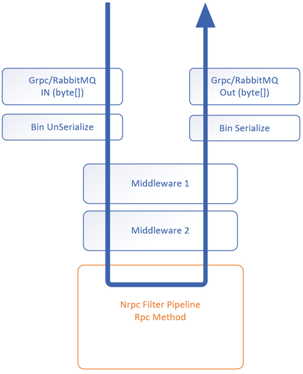

# Nrpc
Nrpc is a light weight rpc engine base on **RabbitMQ** or **Grpc** targeting .NET Standard 2.0.  It use the simple interface to call each other, contains the load balance mode.



## Hello world!
```c#
//service
class Program
{
    static void Main(string[] args)
    {
        var service = Nrpc.Grpc.NRpcManager.CreateServiceProxy("0.0.0.0", 50001, new Service());
        service.Open();
        Console.Read();
    }
}

internal class Service : IService
{
    public void Call(string s)
    {
        Console.WriteLine($"Receive: {s}");
    }
}
```
```c#
//client
class Program
{
    static void Main(string[] args)
    {
        var proxy = Nrpc.Grpc.NRpcManager.CreateClientProxy<IService>("localhost", 50001).Proxy;
        proxy.Call("hello world!");
        Console.Read();
    }
}
```
```c#
//datacontract is referenced by client and service
public interface IService
{
    void Call(string s);
}
```
## Swithch RabbitMQ/Grpc
* **Nrpc.RabbitMQ.NRpcManager** for **RabbitMQ**.
* **Nrpc.Grpc.NRpcManager** for **Grpc**.

```c#
//create RabbitMQ servcie
var p = new MQParam(host, virtualHost, rpcQueue, port, user, password, prefetchCount);
var service = Nrpc.RabbitMQ.NRpcManager.CreateServiceProxy(p, instances);

//create Grpc servcie
var service = Nrpc.Grpc.NRpcManager.CreateServiceProxy("0.0.0.0", 50001, instances);
```

```c#
//create RabbitMQ client
var p = new MQParam(host, virtualHost, rpcQueue, port, user, password, prefetchCount);
var client = Nrpc.RabbitMQ.NRpcManager.CreateClientProxy<IService>(p)

//create Grpc client
var client = Nrpc.Grpc.NRpcManager.CreateClientProxy<IService>("localhost", 50001)
```

## Serialization
Nrpc base on **BinaryFormatter**, make sure all interface model mark as **[Serializable]**.
```c#
[Serializable]
public class CustomObj
{
    //...
}
```
**[Important]** When returned Custom object contains a **Stream**, make sure it mask as **[field: NonSerialized]**.
```c#
Task<ComplexStream> GetComplexStreamAsync();

[Serializable]
public class ComplexStream
{
    [field: NonSerialized]
    public Stream Stream { get; set; }

    public string OtherInfo { get; set; }
}
```
## Supported interface type
```c#
//Sync
public interface IService
{
    void FilterAndHeader();

    T2 CallByGenericType<T1, T2>(T1 obj);

    CustomObj SetAndGetObj(CustomObj obj);

    void CallByCallBack(Action<CustomCallbackObj> cb);

    /// <exception cref="NotImplementedException"></exception>
    void CallBySystemException();

    /// <exception cref="CustomException"></exception>>
    void CallByCustomException();

    Stream GetStream();

    void SetStream(Stream data);

    Stream EchoStream(Stream data);

    ComplexStream GetComplexStream();

    ComplexStream ComplexCall(CustomObj obj, Stream data, Action<CustomCallbackObj> cb);
}
```
```c#
//Async
public interface IServiceAsync
{
    Task<T2> CallByGenericTypeAsync<T1, T2>(T1 obj);

    Task<CustomObj> SetAndGetObj(CustomObj obj);

    /// <exception cref="TaskCanceledException"></exception>
    Task CallByCancelAsync(CancellationToken token);

    Task CallByCallBackAsync(Action<CustomCallbackObj> cb);

    /// <exception cref="NotImplementedException"></exception>
    Task CallBySystemExceptionAsync();

    /// <exception cref="CustomException"></exception>>
    Task CallByCustomExceptionAsync();

    Task<Stream> GetStreamAsync();

    Task SetStreamAsync(Stream data);

    Task<Stream> EchoStreamAsync(Stream data);

    Task<ComplexStream> GetComplexStreamAsync();

    /// <exception cref="TaskCanceledException"></exception>
    Task<ComplexStream> ComplexCallAsync(CustomObj obj, Stream data, Action<CustomCallbackObj> cb, CancellationToken token);
}
```
## Sync/Async
Nrpc could use the both Sync/Async ways to defines the interface.
```c#
void SetObj(CustomObj obj);
Task SetObjAsync(CustomObj obj);
```
## GenericType
Make sure the genericType in interface is mark as **[Serializable]**.
```c#
Task<T2> CallByGenericTypeAsync<T1, T2>(T1 obj);
```
## Header
Header is a type of **Dictionary<string, object>** object, mark sure your object mark as **[Serializable]**.  
* **ThreadHeader**  
Before call method, client set the **ThreadHeader** which mark as **[ThreadStatic]** that guarantee muti-threads don`t influence each other.
```c#
//client
Nrpc.NrpcContext.ThreadHeader.CopyFrom(new Dictionary<string, object> { { "k1", "header value" } });
_proxy.TestHeader();
```
Service can receive the header object which client sent.
```c#
//service
public void TestHeader()
{
    var h = NrpcContext.ThreadHeader.Clone();
}
```
* **DefaultHeader**  
On the client side, when **DefaultHeader** items count > 0, **ThreadHeader** will get the value of **DefaultHeader** when call the remote. This feature is usefull when you wan to transfer a sessionId to service.
```c#
//client
var client = Nrpc.Grpc.NRpcManager.CreateClientProxy<IService>("localhost", 50001);
//set the DefaultHeader with SessionId
client.Context.DefaultHeader.CopyFrom(new Dictionary<string, object> {{"SessionId", 1}});
//will tranfer the header of SessionId to service.
client.Proxy.Call();
```
## ApiContext
**Midderware** or **Filter** can access **ApiContext**, it is

| Property | Type | Description |
| :-----   | :--- | :---------- |
| Header   | Dictionary\<string object> | Header sent from client. |
| Target   | object                     | Service instance of invoked mothod.|
| Method   | MethodInfo                 | Current invoked Method.|
| Args     | object[]                   | Args of invoked mothod.|
## Filter
Filter is common function like MVC. 
```c#
//service
public class TestFilter : NrpcFilterAttribute
{
    public override Task InvokeAsync(ApiContext context)
    {
        Console.Write($"context:{context}");
        return Task.CompletedTask;
    }
}

internal class Service : IService
{
    [TestFilter]
    public void Test()
    {
        //...
    }
}
```
## Middleware
Middleware is common function like MVC. 
```c#
//servcie
var service = Nrpc.Grpc.NRpcManager.CreateServiceProxy("0.0.0.0", 50001, instances);
serviceProxy.UseMiddleware<TestGlobalExceptionMiddleware>("testArg1");

public class TestGlobalExceptionMiddleware : MiddlewareBase
{
    public TestGlobalExceptionMiddleware(RequestDelegate next, string arg1) : base(next)
    {
        Console.WriteLine($"[testArg1] {arg1}");
    }

    public override async Task InvokeAsync(MiddlewareContext context)
    {
        try
        {
            await Next(context);
        }
        catch (Exception e)
        {
            Console.WriteLine($"[log by Middleware] {e.GetType().Name}");
            throw;
        }
    }
}
```
## Load Balance
Only for RabbitMQ.  
When run multiple service instances, ther service will auto apply the load balance, this function is base on the **RabbitMQ**.
## Pass Exception
Can pass the exception via the interface, on the client side, just use the **try** \{} **catch** \{} block.
```c#
/// <exception cref="CustomException"></exception>
Task CallByCustomExceptionAsync();

try
{
     await proxy.CallByCustomExceptionAsync();
}
catch (CustomException e)
{
    //handling exception
}
```
## Cancel
```c#
/// <exception cref="TaskCanceledException"></exception>
Task CallByCancelAsync(CancellationToken token);
```
## Call back
```c#
Task CallByCallBackAsync(Action<CustomCallbackObj> cb);
```
## Stream
```c#
Task<Stream> GetStreamAsync();

Task SetStreamAsync(Stream data);

Task<Stream> EchoStreamAsync(Stream data);

Task<ComplexStream> GetComplexStreamAsync();
[Serializable]
public class ComplexStream
{
    [field: NonSerialized]
    public Stream Stream { get; set; }

    public string OtherInfo { get; set; }
}
```
## Muti interfaces bind to one port
Client should use the **ClientConnectionFactory** manage the connection, that use one connection apply to muti interfaces.
```c#
//service
var service = Nrpc.Grpc.NRpcManager.CreateServiceProxy("0.0.0.0", 50001, new Servcie1(), new Service2());
```
```c#
//client
var factory = new Nrpc.Grpc.ClientConnectionFactory("localhost", 50001);
_proxy = Nrpc.Grpc.NRpcManager.CreateClientProxy<IService1>(factory).Proxy;
_proxyAsync = Nrpc.Grpc.NRpcManager.CreateClientProxy<IService2>(factory).Proxy;
```
## Event
**ClientProxy** has events:  
* **ExceptionInvoked** it usefull when you want to log the exception when call.  
* **Heartbeat** see topic below.  
* **Connected** invoked when conntect the service.  
* **DisConnected** invoked when disconntect the service. if Heartbeat faild will invoke too.
```c#
clientProxy.Connected += (s, e) => Console.WriteLine("[event] Connected");
clientProxy.DisConnected += (s, e) => Console.WriteLine("[event] DisConnected");
clientProxy.ExceptionInvoked += (s, e) => Console.WriteLine("[event] ExceptionInvoked");
clientProxy.Heartbeat += async s => s.Proxy.Hearbeat();
```
## Hearbeat
**ClientProxy** has a **Heartbeat** function after you call **StartHeartbeat()**, the interval is 10 seconds by default.  
Client should register the **Heartbeat** event and implement logic of heartbeat.  
According to **Heartbeat** is successfull or faild, **Connected** or **DisConnected** will invoke correspondingly.
```c#
//client set the heartbeat interval to 10*1000
var proxy = Nrpc.Grpc.NRpcManager.CreateClientProxy<IService>("localhost", 50001, 10*1000).Proxy;
clientProxy.Heartbeat += async s => s.Proxy.Hearbeat();
clientProxy.StartHeartbeat(true);
```
## Others
* An interface args can only contains one **Action**, one **Stream**, same as return value.
```c#
ComplexStream Call(Stream data, Action<CustomCallbackObj> cb);
```
* **TimeoutInterval** of call is a mechanism of Nrpc owns, it do not use the Grpc or RabbitMQ timeout mechanism.
```c#
CreateClientProxy<TService>(string host, int port, int timeoutInterval = 1200000)
```
## Samples
* [Hello World](samples/HelloWorld)
* [Base](samples/Base)
* [LoadBalance](samples/LoadBalance)
