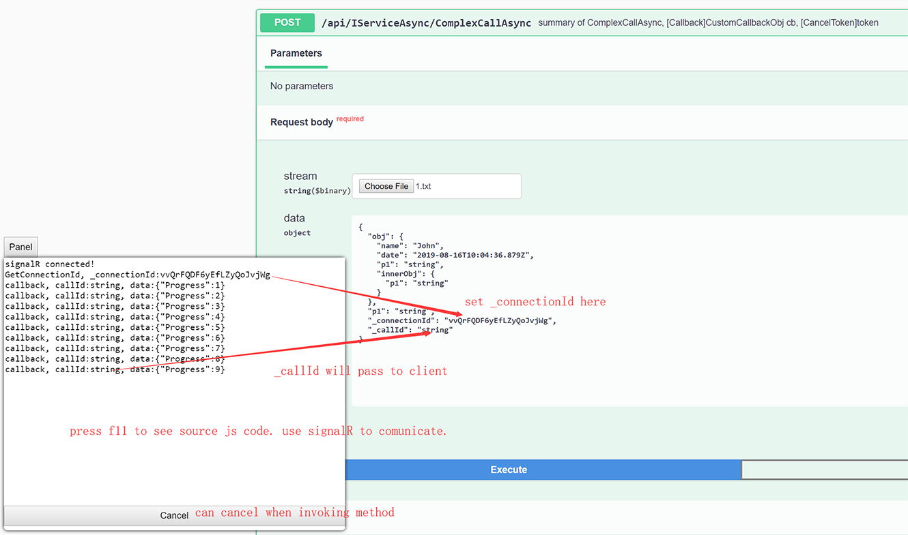

# NetRpc
NetRpc is a light weight rpc engine base on **RabbitMQ**, **Grpc**, **Http** targeting .NET Standard 2.0.  It use the simple interface to call each other, 
provide callback/cancel during invoking, so especially suitable for handle **long call**.


## Overall
NetRpc provide **RabbitMQ**/**Grpc**/**Http** Channels to connect, each one has different advantages.
* **RabbitMQ** provide load balance, queue feature.
* **Grpc** use http2, provide all http2 advantages.
* **Http** use webapi, also provide swagger interface.

All channels use uniform contract interface, so easily to switch channel without modify service implement.


## RabbitMQ/Grpc

## Hello world!
```c#
//service
class Program
{
    static void Main(string[] args)
    {
        var o = new GrpcServiceOptions();
        o.AddPort("0.0.0.0", 50001);
        var host = NetRpc.Grpc.NetRpcManager.CreateHost(o, null, typeof(Service));
        await host.StartAsync();
    }
}

internal class Service : IService
{
    public void Call(string s)
    {
        Console.WriteLine($"Receive: {s}");
    }
}
```
```c#
//client
class Program
{
    static void Main(string[] args)
    {
        var proxy = NetRpc.Grpc.NetRpcManager.CreateClientProxy<IService>(new Channel("localhost", 50001, ChannelCredentials.Insecure));
        p.Proxy.Call("hello world.");
        Console.Read();
    }
}
```
```c#
//datacontract is referenced by client and service
public interface IService
{
    void Call(string s);
}
```
## Swithch RabbitMQ/Grpc
* **NetRpc.RabbitMQ.NetRpcManager** for **RabbitMQ**.
* **NetRpc.Grpc.NetRpcManager** for **Grpc**.
## Initialize by DI
There has two ways to initialize service and client, See DI sample below:
```c#
//service
var host = new HostBuilder()
    .ConfigureServices((context, services) =>
    {
        services.AddNetRpcGrpcService(i => i.AddPort("0.0.0.0", 50001));
        services.AddNetRpcServiceContract<Service>();
    })
    .Build();
```
```c#
//client
var host = new HostBuilder()
    .ConfigureServices((context, services) =>
    {
        services.AddHostedService<GrpcHostedService>();
        services.AddNetRpcGrpcClient<IService>(i =>
            i.Channel = new Channel("localhost", 50001, ChannelCredentials.Insecure));
    })
    .Build();
```
Other way is **NetRpcManager**.
## Serialization
NetRpc base on **BinaryFormatter**, make sure all interface model mark as **[Serializable]**.
```c#
[Serializable]
public class CustomObj
{
    //...
}
```
**[Important]** When returned Custom object contains a **Stream**, make sure it mask as **[field: NonSerialized]**.
```c#
Task<ComplexStream> GetComplexStreamAsync();

[Serializable]
public class ComplexStream
{
    [field: NonSerialized]
    public Stream Stream { get; set; }

    public string OtherInfo { get; set; }
}
```
## Supported interface type
```c#
//Sync
public interface IService
{
    void FilterAndHeader();

    T2 CallByGenericType<T1, T2>(T1 obj);

    CustomObj SetAndGetObj(CustomObj obj);

    void CallByCallBack(Action<CustomCallbackObj> cb);

    /// <exception cref="NotImplementedException"></exception>
    void CallBySystemException();

    /// <exception cref="CustomException"></exception>>
    void CallByCustomException();

    Stream GetStream();

    void SetStream(Stream data);

    Stream EchoStream(Stream data);

    ComplexStream GetComplexStream();

    ComplexStream ComplexCall(CustomObj obj, Stream data, Action<CustomCallbackObj> cb);
}
```
```c#
//Async
public interface IServiceAsync
{
    Task<T2> CallByGenericTypeAsync<T1, T2>(T1 obj);

    Task<CustomObj> SetAndGetObj(CustomObj obj);

    /// <exception cref="TaskCanceledException"></exception>
    Task CallByCancelAsync(CancellationToken token);

    Task CallByCallBackAsync(Action<CustomCallbackObj> cb);

    /// <exception cref="NotImplementedException"></exception>
    Task CallBySystemExceptionAsync();

    /// <exception cref="CustomException"></exception>>
    Task CallByCustomExceptionAsync();

    Task<Stream> GetStreamAsync();

    Task SetStreamAsync(Stream data);

    Task<Stream> EchoStreamAsync(Stream data);

    Task<ComplexStream> GetComplexStreamAsync();

    /// <exception cref="TaskCanceledException"></exception>
    Task<ComplexStream> ComplexCallAsync(CustomObj obj, Stream data, Action<CustomCallbackObj> cb, CancellationToken token);
}
```
## Sync/Async
NetRpc could use the both Sync/Async ways to defines the interface.
```c#
void SetObj(CustomObj obj);
Task SetObjAsync(CustomObj obj);
```
## GenericType
Make sure the genericType in interface is mark as **[Serializable]**.
```c#
Task<T2> CallByGenericTypeAsync<T1, T2>(T1 obj);
```
## Header
Header is a type of **Dictionary<string, object>** object, mark sure your object mark as **[Serializable]**.  
* **ThreadHeader**  
Before call action, client set the **ThreadHeader** which mark as **[ThreadStatic]** that guarantee muti-threads don`t influence each other.
```c#
//client
NetRpc.NetRpcContext.ThreadHeader.CopyFrom(new Dictionary<string, object> { { "k1", "header value" } });
_proxy.TestHeader();
```
Service can receive the header object which client sent.
```c#
//service
public void TestHeader()
{
    var h = NetRpcContext.ThreadHeader.Clone();
}
```
* **DefaultHeader**  
On the client side, when **DefaultHeader** items count > 0, **ThreadHeader** will get the value of **DefaultHeader** when call the remote. This feature is usefull when you want to transfer a sessionId to service.
```c#
//client
var proxy = NetRpc.Grpc.NetRpcManager.CreateClientProxy<IService>(new Channel("localhost", 50001, ChannelCredentials.Insecure)).Proxy;
//set the DefaultHeader with SessionId
client.Context.DefaultHeader.CopyFrom(new Dictionary<string, object> {{"SessionId", 1}});
//will tranfer the header of SessionId to service.
client.Proxy.Call();
```
## ContractLifeTime
```c#
//The same instance for each request.
services.AddNetRpcServiceContract<Service>(ContractLifeTime.Singleton);

//create new instance for each request. 
services.AddNetRpcServiceContract<Service>(ContractLifeTime.Scoped);
```
## RpcContext
**Midderware** or **Filter** can access **RpcContext**, it is

| Property         | Type | Description |
| :-----           | :--- | :---------- |
| Header           | Dictionary\<string object> | Header sent from client. |
| Target           | object                     | Service instance of invoked action.|
| InstanceMethodInfo | InstanceMethodInfo           | Current invoked method.  |
| InterfaceMethodInfo | InterfaceMethodInfo     | Current invoked interface method.  |
| ActionInfo       | ActionInfo                 | Warpped info of current invoked method.  |
| Args             | object[]                   | Args of invoked action.  |
| ServiceProvider  | IServiceProvider           | ServiceProvider of invoked action.  |
| Result           | object                     | Result of invoked action.|
## Filter
Filter is common function like MVC. 
```c#
//service
public class TestFilter : NetRpcFilterAttribute
{
    public override Task InvokeAsync(RpcContext context)
    {
        Console.Write($"context:{context}");
        return Task.CompletedTask;
    }
}

internal class Service : IService
{
    [TestFilter]
    public void Test()
    {
        //...
    }
}
```
## NetRpc Middleware
The way use **NetRpc Middleware** and use **MVC Middleware** is same, the only difference is use **RpcContext** instead of **HttpContext**.  
Support DI Type and ctor args.
```c#
//servcie
var mOpt = new MiddlewareOptions();
mOpt.UseMiddleware<TestGlobalExceptionMiddleware>("arg1value");

public class TestGlobalExceptionMiddleware
{
    private readonly RequestDelegate _next;

    public TestGlobalExceptionMiddleware(RequestDelegate next, string arg1, DIType diType)
    {
        _next = next;
        Console.WriteLine($"{arg1}");
    }

    public async Task InvokeAsync(RpcContext context, DIType diType)
    {
        try
        {
            await _next(context);
        }
        catch (Exception e)
        {
            Console.WriteLine($"[log by Middleware] {e.GetType().Name}");
            throw;
        }
    }
}
```
## Load Balance
Only for RabbitMQ.  
When run multiple service instances, ther service will auto apply the load balance, this function is base on the **RabbitMQ**.
## FaultException\<T>
When create **ClientProxy** that can pass **isWrapFaultException**, if true will wrap Exception to **FaultExcetpion\<Exception>**.  
FaultException is usefull when you want to get the exactly **StackTrace** info.  
**isWrapFaultException** is invalid to **OperationCanceledException** and **TaskCanceledException** because of convenience purpose.

**FaultException** is

| Property | Type | Description |
| :-----   | :--- | :---------- |
| Detail   | Exception | Threw exception, will save the orginal **StackTrace** when Exception via remote transfer. |
| Action   | string | Invoked action name and args, if many actions split by '\|'.

```c#
//service
internal class ServiceAsync : IServiceAsync
{
    public Task CallBySystemExceptionAsync()
    {
        throw new NotImplementedException();
    }
}
```
```c#
//client
var proxy = NetRpc.Grpc.NetRpcManager.CreateClientProxy<IService>(new Channel("localhost", 50001, ChannelCredentials.Insecure), isWrapFaultException:true).Proxy;
try
{
    await proxy.CallBySystemExceptionAsync();
}
catch (FaultException<NotImplementedException> e)
{
    //catched FaultException<NotImplementedException> when set isWrapFaultException to true.
    //e.Deta.StackTrace will get the orginal info.
}
catch (FaultException e2)
{
   //catched all type of FaultException<> when set isWrapFaultException to true.
}
catch (OperationCanceledException e2)
{
   //catched OperationCanceledException when set isWrapFaultException to false/true.
}
catch (TaskCanceledException e2)
{
   //catched TaskCanceledException when set isWrapFaultException to false/true.
}
catch (NotImplementedException e2)
{
   //catched NotImplementedException when set isWrapFaultException to false.
}
```
## Cancel
```c#
/// <exception cref="TaskCanceledException"></exception>
Task CallByCancelAsync(CancellationToken token);
```
## Call back
```c#
Task CallByCallBackAsync(Action<CustomCallbackObj> cb);
```
## Stream
```c#
Task<Stream> GetStreamAsync();

Task SetStreamAsync(Stream data);

Task<Stream> EchoStreamAsync(Stream data);

Task<ComplexStream> GetComplexStreamAsync();
[Serializable]
public class ComplexStream
{
    [field: NonSerialized]
    public Stream Stream { get; set; }

    public string OtherInfo { get; set; }
}
```
## Muti interfaces bind to one port
Client should use the **ClientConnectionFactory** manage the connection, that use one connection apply to muti interfaces.
```c#
//service
var service = NetRpc.Grpc.NetRpcManager.CreateServiceProxy(new ServerPort("0.0.0.0", 50001, ServerCredentials.Insecure), new Servcie1(), new Service2());
```
```c#
//client
var factory = new NetRpc.Grpc.ClientConnectionFactory("localhost", 50001);
_proxy = NetRpc.Grpc.NetRpcManager.CreateClientProxy<IService1>(factory).Proxy;
_proxyAsync = NetRpc.Grpc.NetRpcManager.CreateClientProxy<IService2>(factory).Proxy;
```
## Event
**ClientProxy** has events:  
* **ExceptionInvoked** it usefull when you want to log the exception when call.  
* **Heartbeat** see topic below.  
* **Connected** invoked when conntect the service.  
* **DisConnected** invoked when disconntect the service. if Heartbeat faild will invoke too.
```c#
clientProxy.Connected += (s, e) => Console.WriteLine("[event] Connected");
clientProxy.DisConnected += (s, e) => Console.WriteLine("[event] DisConnected");
clientProxy.ExceptionInvoked += (s, e) => Console.WriteLine("[event] ExceptionInvoked");
clientProxy.Heartbeat += async s => s.Proxy.Hearbeat();
```
## Hearbeat
**ClientProxy** has a **Heartbeat** function after you call **StartHeartbeat()**, the interval is 10 seconds by default.  
Client should register the **Heartbeat** event and implement logic of heartbeat.  
According to **Heartbeat** is successfull or faild, **Connected** or **DisConnected** will invoke correspondingly.
```c#
//client set the heartbeat interval to 10*1000
var proxy = NetRpc.Grpc.NetRpcManager.CreateClientProxy<IService>(new Channel("localhost", 50001, ChannelCredentials.Insecure), 10*1000).Proxy;
clientProxy.Heartbeat += async s => s.Proxy.Hearbeat();
clientProxy.StartHeartbeat(true);
```
# [Http] NetRpc.Http
NetRpc.Http provide:
* **Webapi** for call.
* **Swagger** for view api and test.
* **SignalR** for callback and cancel during method invoking.


## [Http] Create Host
* Use **NetRpcManager** create host:
```c#
//service
var webHost = NetRpcManager.CreateHost(
    8080,
    "/callback",
    true,
    new HttpServiceOptions { ApiRootPath = "/api"}, 
    null,
    typeof(ServiceAsync));
await webHost.RunAsync();
```
* Use DI to create NetRpcHttp service, also could create NetRpcHttp service base on exist MVC servcie.
```c#
//regist services
services.AddSignalR();         // add SignalR service if need cancel/callback support
services.AddNetRpcSwagger();   // add Swgger service
services.AddNetRpcHttp(i =>    // add RpcHttp service
{
    i.ApiRootPath = "/api";
    i.IgnoreWhenNotMatched = false;
    i.IsClearStackTrace = false;
}, i =>
{
    i.UseMiddleware<MyNetRpcMiddleware>();   // define NetRpc Middleware
});
services.AddNetRpcServiceContract(instanceTypes); // add Contracts
```
```c#
//use components
app.UseSignalR(routes => { routes.MapHub<CallbackHub>(hubPath); });   // define CallbackHub if need cancel/callback support
app.UseNetRpcSwagger();   // use NetRpcSwagger middleware
app.UseNetRpcHttp();      // use NetRpcHttp middleware
```
## [Http] Swagger
Use [Swashbuckle.AspNetCore.Swagger](https://github.com/domaindrivendev/Swashbuckle.AspNetCore) to implement swagger feature.

Add codes below to enabled swagger function.
```c#
services.AddNetRpcSwagger();   // add Swgger service
...
app.UseNetRpcSwagger();        // use NetRpcSwagger middleware
```
The demo show how to call a method with callback and cancel:


If define Callback Action\<T> and CancelToken supported, need set **\_connectionId** and **_callId** when request.
OperationCanceledException will receive respones with statuscode 600.  


Also support summary on model or method.
## [Http] Callback and Cancel
Contract define the **Action\<T>** and **CancellationToken** to enable this feature.
```c#
Task CallAsync(Action<int> cb, CancellationToken token);
```
Client code belows show how to get connectionId, how to receive callback, how to cancel a method.
```javascript
//client js side
var connection = new signalR.HubConnectionBuilder().withUrl("{hubUrl}").build();

//GetConnectionId function
connection.start().then(function () {
    addText("signalR connected!");
    connection.invoke("GetConnectionId").then((cid) => {
        addText("GetConnectionId, _connectionId:" + cid);
    });
}).catch(function (err) {
    return console.error(err.toString());
});

//Callback
connection.on("Callback", function (callId, data) {
    addText("callback, callId:" + callId + ", data:" + data);
});

//Cancel
document.getElementById("cancelBtn").addEventListener("click", function (event) {
    connection.invoke("Cancel").catch(function (err) {
        return console.error(err.toString());
    });

    event.preventDefault();
});
```
## [Http] NetRpcProducesResponseType
If contract has **Exception** defined, should use **NetRpcProducesResponseType** to define **statuscode**, 
use **response code** to define summary(will display in Swagger), 
otherwise NetRpc will use statuscode **400** to define all Exception by default.
```c#
/// <response code="400">CustomException error.</response>
/// <response code="401">CustomException2 error</response>
[NetRpcProducesResponseType(typeof(CustomException), 400)]
[NetRpcProducesResponseType(typeof(CustomException2), 401)]
Task CallByCustomExceptionAsync();
```
## [Http] ResponseTextException
ResponseTextException define pain text response with statucode.
```c#
public async Task CallByResponseTextExceptionAsync()
{
    throw new ResponseTextException("this is customs text. statucode is 701.", 701);
}
````
Also should use **response code** define summary, it will display in swagger.
```c#
/// <response code="701">return the pain text.</response>
Task CallByResponseTextExceptionAsync();
```
## [Http] Stream
Normally stream of return value will map to filestream, if you define **StreamName** property, will set to file name to client.
```c#
//stream of return value
Task<ComplexStream> GetComplexStreamAsync();
...
public class ComplexStream
{
    public Stream Stream { get; set; }
    public string StreamName { get; set; }  //the property will map to file name.
}
```
## Others
* An interface args can only contains one **Action**, one **Stream**, same as return value.
```c#
ComplexStream Call(Stream data, Action<CustomCallbackObj> cb);
```
* **TimeoutInterval** of call is a mechanism of NetRpc owns, it do not use the Grpc or RabbitMQ timeout mechanism.
```c#
CreateClientProxy<TService>(Channel channel, int timeoutInterval = 1200000)
```
## Samples
* [Hello World](samples/HelloWorld)
* [Api](samples/Api)
* [Http](samples/Http)
* [LoadBalance](samples/LoadBalance)
* [InitializeByDI](samples/InitializeByDI)