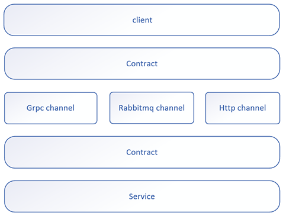
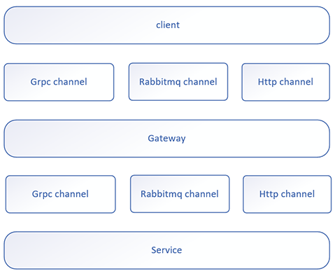
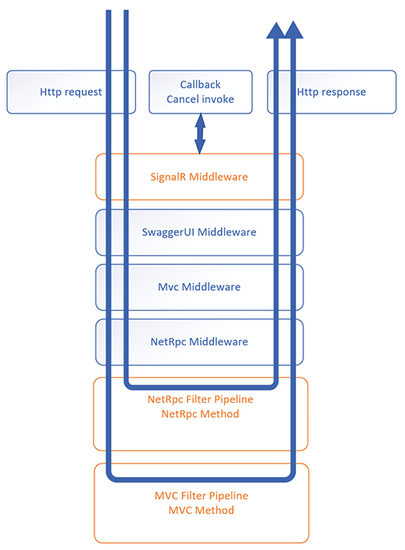
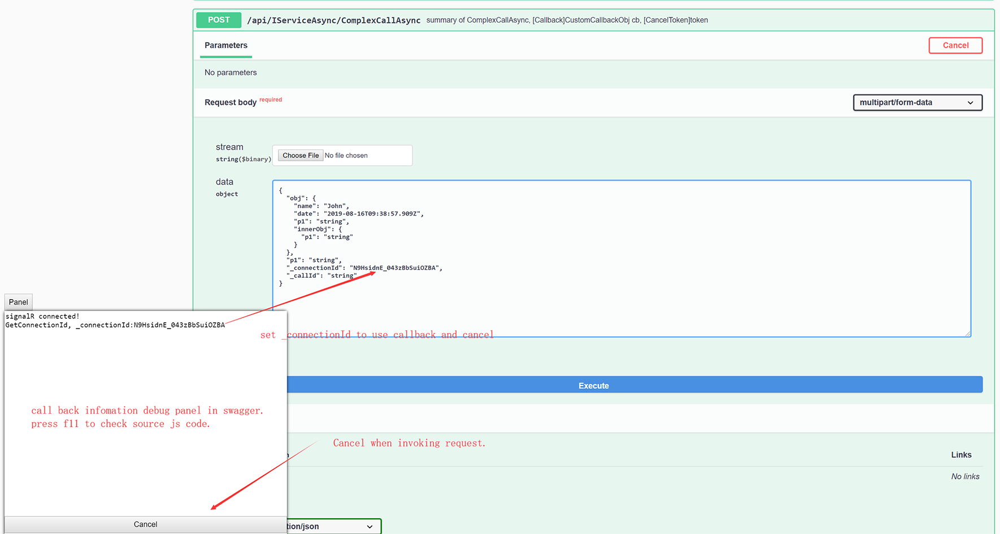

# NetRpc
NetRpc is a light weight rpc engine base on **RabbitMQ**, **Grpc**, **Http** targeting .NET Standard 2.0.  It use the simple interface to call each other, 
provide callback/cancel during invoking, so especially suitable for handle **long call**.

## Hello world!
```c#
//service side
class Program
{
    static void Main(string[] args)
    {
        var o = new GrpcServiceOptions();
        o.AddPort("0.0.0.0", 50001);
        var host = NetRpc.Grpc.NetRpcManager.CreateHost(o, null, new Contract<IService, Service>()).StartAsync();
        await host.StartAsync();
    }
}

internal class Service : IService
{
    public void Call(string s)
    {
        Console.WriteLine($"Receive: {s}");
    }
}
```
```c#
//client side
class Program
{
    static void Main(string[] args)
    {
        var proxy = NetRpc.Grpc.NetRpcManager.CreateClientProxy<IService>(new Channel("localhost", 50001, ChannelCredentials.Insecure));
        p.Proxy.Call("hello world.");
        Console.Read();
    }
}
```
```c#
//datacontract is referenced by client and service
public interface IService
{
    void Call(string s);
}
```

## Overall
NetRpc provide **RabbitMQ**/**Grpc**/**Http** Channels to connect, each one has different advantages.
* **RabbitMQ** provide load balance, queue feature.
* **Grpc** use http2, provide all http2 advantages.
* **Http** use webapi, also provide swagger api.

All channels use uniform contract, so easily to switch channel without modify service implementation.



## RabbitMQ/Grpc
There is message channel for RabbitMQ and Grpc, Http pls see topic blow.


## Swithch RabbitMQ/Grpc/Http
* **NetRpc.RabbitMQ.NetRpcManager** for **RabbitMQ**.
* **NetRpc.Grpc.NetRpcManager** for **Grpc**.
* **NetRpc.Http.NetRpcManager** for **Http**.
## Initialize by DI
There has two ways to initialize service and client, See DI sample below:
```c#
//service side
var host = new HostBuilder()
    .ConfigureServices((context, services) =>
    {
        services.AddNetRpcGrpcService(i => i.AddPort("0.0.0.0", 50001));
        services.AddNetRpcContractSingleton<IService, Service>();
    })
    .Build();
```
```c#
//client side
var host = new HostBuilder()
    .ConfigureServices((context, services) =>
    {
        services.AddHostedService<GrpcHostedService>();
        services.AddNetRpcGrpcClient<IService>(i =>
            i.Channel = new Channel("localhost", 50001, ChannelCredentials.Insecure));
    })
    .Build();
```
Other way is **NetRpcManager**.
## Serialization
RabbitMQ, Grpc channel base on **BinaryFormatter**, make sure all contract model mark as **[Serializable]**.  
Http channel base on **JsonFormatter**.
```c#
[Serializable]
public class CustomObj
{
    //...
}
```
**[Important]** When returned Custom object contains a **Stream**:  
RabbitMQ, Grpc channel make sure it mask as **[field: NonSerialized]**.  
Http channel make sure it mask as **[JsonIgnore]**.
```c#
Task<ComplexStream> GetComplexStreamAsync();

[Serializable]
public class ComplexStream
{
    [field: NonSerialized]
    [JsonIgnore]
    public Stream Stream { get; set; }

    public string OtherInfo { get; set; }
}
```
## Supported contract type
```c#
//Async
public interface IServiceAsync
{
    Task<T2> CallByGenericTypeAsync<T1, T2>(T1 obj);

    Task<CustomObj> SetAndGetObj(CustomObj obj);

    /// <exception cref="TaskCanceledException"></exception>
    Task CallByCancelAsync(CancellationToken token);

    Task CallByCallBackAsync(Action<CustomCallbackObj> cb);

    /// <exception cref="NotImplementedException"></exception>
    Task CallBySystemExceptionAsync();

    /// <exception cref="CustomException"></exception>>
    Task CallByCustomExceptionAsync();

    Task<Stream> GetStreamAsync();

    Task SetStreamAsync(Stream data);

    Task<Stream> EchoStreamAsync(Stream data);

    Task<ComplexStream> GetComplexStreamAsync();

    /// <exception cref="TaskCanceledException"></exception>
    Task<ComplexStream> ComplexCallAsync(CustomObj obj, Stream data, Action<CustomCallbackObj> cb, CancellationToken token);
}
```
## Sync/Async
NetRpc could use the both Sync/Async ways to defines the contract.
```c#
void Call();
Task CallAsync();

int GetValue();
Task<int> GetValueAsync();
```
## GenericType
Make sure the genericType in contract is mark as **[Serializable]**.
```c#
Task<T2> CallByGenericTypeAsync<T1, T2>(T1 obj);
```
## Header
Header is a type of **Dictionary<string, object>** object, mark sure your object mark as **[Serializable]**.  
* **ThreadHeader**  
Before call action, client set the **ThreadHeader** which mark as **[ThreadStatic]** that guarantee muti-threads don`t influence each other.
```c#
//client side
NetRpc.NetRpcContext.ThreadHeader.CopyFrom(new Dictionary<string, object> { { "k1", "header value" } });
_proxy.TestHeader();
```
Service can receive the header object which client sent.
```c#
//service side
public void TestHeader()
{
    var h = NetRpcContext.ThreadHeader.Clone();
}
```
* **DefaultHeader**  
On the client side, when **DefaultHeader** items count > 0, **ThreadHeader** will get the value of **DefaultHeader** when call the remote. This feature is usefull when you want to transfer a sessionId to service.
```c#
//client side
var proxy = NetRpc.Grpc.NetRpcManager.CreateClientProxy<IService>(new Channel("localhost", 50001, ChannelCredentials.Insecure)).Proxy;
//set the DefaultHeader with SessionId
client.Context.DefaultHeader.CopyFrom(new Dictionary<string, object> {{"SessionId", 1}});
//will tranfer the header of SessionId to service.
client.Proxy.Call();
```
## ContractLifeTime
```c#
//Singleton: create one instance for every request.
services.AddNetRpcContractSingleton<IService, Service>();

//Scoped: create new instance for each request. 
services.AddNetRpcContractScoped<IService,Service>();
```
## RpcContext
**Midderware** or **Filter** can access **RpcContext**, it is

| Property         | Type | Description |
| :-----           | :--- | :---------- |
| Header           | Dictionary\<string object> | Header sent from client. |
| Target           | object                     | Service instance of invoked action.|
| InstanceMethodInfo | MethodInfo               | Current invoked method.  |
| ContractMethodInfo | MethodInfo               | Current invoked contract method.  |
| ActionInfo       | ActionInfo                 | Warpped info of current invoked method.  |
| Args             | object[]                   | Args of invoked action.  |
| Callback         | Action\<object>            | Callback of invoked action.  |
| Token            | CancellationToken          | CancellationToken of invoked action.  |
| Stream           | Stream                     | Stream of invoked action.  |
| ServiceProvider  | IServiceProvider           | ServiceProvider of invoked action.  |
| Result           | object                     | Result of invoked action.|
## Filter
Filter is common function like MVC. 
```c#
//service side
public class TestFilter : NetRpcFilterAttribute
{
    public override Task InvokeAsync(RpcContext context)
    {
        Console.Write($"context:{context}");
        return Task.CompletedTask;
    }
}

internal class Service : IService
{
    [TestFilter]
    public void Test()
    {
        //...
    }
}
```
## NetRpc Middleware
The way use **NetRpc Middleware** and use **MVC Middleware** is same, the only difference is use **RpcContext** instead of **HttpContext**.  
Support DI Type and ctor args.
```c#
//servcie
services.AddNetRpcMiddleware(i => i.UseMiddleware<TestGlobalExceptionMiddleware>("arg1value"));

public class TestGlobalExceptionMiddleware
{
    private readonly RequestDelegate _next;

    public TestGlobalExceptionMiddleware(RequestDelegate next, string arg1, DIType diType)
    {
        _next = next;
        Console.WriteLine($"{arg1}");
    }

    public async Task InvokeAsync(RpcContext context, DIType diType)
    {
        try
        {
            await _next(context);
        }
        catch (Exception e)
        {
            Console.WriteLine($"[log by Middleware] {e.GetType().Name}");
            throw;
        }
    }
}
```
## Load Balance
Only for RabbitMQ.  
When run multiple service instances, ther service will auto apply the load balance, this function is base on the RabbitMQ.  
**MQOptions.PrefetchCount**: The service will acquire more messages, up to the PrefetchCount limit, defalut value is 1.
## FaultException\<T>
**FaultException** is

| Property | Type | Description |
| :-----   | :--- | :---------- |
| Detail   | Exception | Threw exception, will save the orginal **StackTrace** when Exception via remote transfer. |
| Action   | string | Invoked action name and args, if many actions split by '\|'.

```c#
//service side
internal class ServiceAsync : IServiceAsync
{
    public Task CallBySystemExceptionAsync()
    {
        throw new NotImplementedException();
    }
}
```
```c#
//client side
var proxy = NetRpc.Grpc.NetRpcManager.CreateClientProxy<IService>(new Channel("localhost", 50001, ChannelCredentials.Insecure)).Proxy;
try
{
    await proxy.CallBySystemExceptionAsync();
}
catch (FaultException<NotImplementedException> e)
{
    //e.Deta.StackTrace will get the orginal info.
}
catch (FaultException e2)
{

}
catch (OperationCanceledException e2)
{

}
catch (TaskCanceledException e2)
{

}

```
## Cancel
```c#
/// <exception cref="TaskCanceledException"></exception>
Task CallByCancelAsync(CancellationToken token);
```
## Call back
```c#
Task CallByCallBackAsync(Action<CustomCallbackObj> cb);
```

Built-in **CallbackThrottlingMiddleware** is useful when callback is progress, normally progress do not need callback every time to client, also for saving network resources.
```c#
//service side
services.AddNetRpcMiddleware(i => i.UseCallbackThrottling(1000)); //limit to one call per second
//or this:
services.AddNetRpcCallbackThrottling(1000);
...
public async Task Call(Action<int> cb)
{
    for (int i = 0; i <= 20; i++)
    {
        await Task.Delay(100);
        cb.Invoke(i);
        Console.WriteLine($"Send callback: {i}");
    }
}
```
```c#
//client side
await proxy.Call(i => Console.WriteLine($"receive callback: {i}"));
```
```c
//service sent 20 callbacks by interval 100ms.
Send callback: 0
Send callback: 1
Send callback: 2
Send callback: 3
Send callback: 4
Send callback: 5
Send callback: 6
Send callback: 7
Send callback: 8
Send callback: 9
Send callback: 10
Send callback: 11
Send callback: 12
Send callback: 13
Send callback: 14
Send callback: 15
Send callback: 16
Send callback: 17
Send callback: 18
Send callback: 19
Send callback: 20      //at the end will force send last callback

//----------------------------------------------------

//client only received 4 callbacks by interval 1000ms
receive callback: 0
receive callback: 8
receive callback: 17
receive callback: 20   //will receive last callback.
```
## Stream
```c#
Task<Stream> GetStreamAsync();

Task SetStreamAsync(Stream data);

Task<Stream> EchoStreamAsync(Stream data);

Task<ComplexStream> GetComplexStreamAsync();
[Serializable]
public class ComplexStream
{
    [field: NonSerialized]
    public Stream Stream { get; set; }

    public string OtherInfo { get; set; }
}
```
## MQPostAttribute
Only for RabbitMQ channel, means post way to call, after sent message to rabbitMQ then return immediately, consumer will consum messages in queue asynchronous.  
Post method define has some limits, no callback Action, no cancelToken, no return value.
```c#
[NetRpcPost]
Task PostAsync(string s1, Stream stream);
```
## Multi contracts bind to one port
Client should use the **ClientConnectionFactory** manage the connection, that use one connection apply to muti contracts.
```c#
//service side
var service = NetRpc.Grpc.NetRpcManager.CreateServiceProxy(new ServerPort("0.0.0.0", 50001, ServerCredentials.Insecure), new Servcie1(), new Service2());
```
```c#
//client side
var factory = new NetRpc.Grpc.ClientConnectionFactory("localhost", 50001);
_proxy = NetRpc.Grpc.NetRpcManager.CreateClientProxy<IService1>(factory).Proxy;
_proxyAsync = NetRpc.Grpc.NetRpcManager.CreateClientProxy<IService2>(factory).Proxy;
```
## Client Event
**ClientProxy** has events:  
* **ExceptionInvoked** it usefull when you want to log the exception when call.  
* **Heartbeat** see topic below.  
* **Connected** invoked when conntect the service.  
* **DisConnected** invoked when disconntect the service. if Heartbeat faild will invoke too.
```c#
clientProxy.Connected += (s, e) => Console.WriteLine("[event] Connected");
clientProxy.DisConnected += (s, e) => Console.WriteLine("[event] DisConnected");
clientProxy.ExceptionInvoked += (s, e) => Console.WriteLine("[event] ExceptionInvoked");
clientProxy.Heartbeat += async s => s.Proxy.Hearbeat();
```
## Hearbeat
**ClientProxy** has a **Heartbeat** function after you call **StartHeartbeat()**, the interval is 10 seconds by default.  
Client should register the **Heartbeat** event and implementation of heartbeat.  
According to **Heartbeat** is successfull or faild, **Connected** or **DisConnected** will invoke correspondingly.
```c#
//client set the heartbeat interval to 10*1000
var proxy = NetRpc.Grpc.NetRpcManager.CreateClientProxy<IService>(new Channel("localhost", 50001, ChannelCredentials.Insecure), 10*1000).Proxy;
clientProxy.Heartbeat += async s => s.Proxy.Hearbeat();
clientProxy.StartHeartbeat(true);
```
## Options support realtime update
Normally four options below support realtime update, if options has changed, will reset underlying service use the new options, do not need restart process to take options effect.
* GrpcServiceOptions
* GrpcClientOptions
* RabbitMQServiceOptions
* RabbitMQClientOptions

Note: only for DI mode:
```c#
services.AddNetRpcGrpcService(i => i.AddPort("0.0.0.0", 50001));
```

## Gateway

Gateway has many advantages:
* Convert Channel.
* Provide exception handle.
* Provide access authority.
* ...



The code blow show how to Receive message from RabbitMQ channel client and send to Grpc channel service.
```c#
 //set single target by DI.
services.AddNetRpcRabbitMQService(i => i.Value = TestHelper.Helper.GetMQOptions());
services.AddNetRpcGateway<IService>(o => o.Channel = new Channel("localhost", 50001, ChannelCredentials.Insecure));
services.AddNetRpcGateway<IService2>();

//set different target point.
//var p1 = NetRpcManager.CreateClientProxy<IService>(new Channel("localhost", 50001, ChannelCredentials.Insecure)).Proxy;
//var p2 = NetRpcManager.CreateClientProxy<IService2>(new Channel("localhost2", 50001, ChannelCredentials.Insecure)).Proxy;
//services.AddNetRpcContractSingleton(typeof(IService), p1);
//services.AddNetRpcContractSingleton(typeof(IService2), p2);
```
Also privode middleware in the gateway service, can add access authority if needed.

# [Http] NetRpc.Http
NetRpc.Http provide:
* **Webapi** for call api.
* **Swagger** for display and test api.
* **SignalR** for callback and cancel during method invoking.

Note:
* **Swagger** is not necessary.
* **Mvc** is not necessary.



## [Http] Create Host
Use **NetRpcManager** create host:
```c#
//service side
var webHost = NetRpcManager.CreateHost(
    8080,
    "/callback",
    true,
    new HttpServiceOptions { ApiRootPath = "/api"}, 
    null,
    typeof(ServiceAsync));
await webHost.RunAsync();
```
Use DI to create NetRpcHttp service, also could create NetRpcHttp service base on exist MVC servcie.
```c#
//regist services
services.AddSignalR();         // add SignalR service
services.AddNetRpcSwagger();   // add Swgger service
services.AddNetRpcHttp(i =>    // add RpcHttp service
{
    i.ApiRootPath = "/api";
    i.IgnoreWhenNotMatched = false;
});
services.AddNetRpcMiddleware(i => i.UseMiddleware<MyNetRpcMiddleware>());  // define NetRpc Middleware
services.AddNetRpcServiceContract(instanceTypes); // add Contracts
```
```c#
//use components
app.UseSignalR(routes => { routes.MapHub<CallbackHub>(hubPath); });   // define CallbackHub
app.UseNetRpcSwagger();   // use NetRpcSwagger middleware
app.UseNetRpcHttp();      // use NetRpcHttp middleware
```
## [Http] Client
use **NetRpc.Http.Client.NetRpcManager.CreateClientProxy** to create a client instance.
```c#
_proxyAsync = NetRpcManager.CreateClientProxy<IServiceAsync>(
    new HttpClientOptions() { 
        SignalRHubUrl = "http://localhost:5000/callback",
        ApiUrl = "http://localhost:5000/api" 
    }).Proxy;
```
Also support **DI**.
## [Http] Swagger
Use [Swashbuckle.AspNetCore.Swagger](https://github.com/domaindrivendev/Swashbuckle.AspNetCore) to implement swagger feature.  
Note: swagger need add Http channel, swagger api path is **[HttpServiceOptions.ApiRootPath]/swagger**, if apiRootPath is "api", should like http://localhost:5000/api/swagger, if apiRootPath is null, should like http://localhost:5000/swagger.  
Add codes below to enabled swagger function.
```c#
services.AddNetRpcSwagger();   // add Swgger service
...
app.UseNetRpcSwagger();        // use NetRpcSwagger middleware
```
The demo show how to call a method with callback and cancel:


If define Callback Action\<T> and CancelToken supported, need set **\_connectionId** and **_callId** when request.
OperationCanceledException will receive respones with statuscode 600.  



Also support summary on model or method.
## HttpServiceOptions
```c#
/// <summary>
/// Api root path, like '/api', default value is null.
/// </summary>
public string ApiRootPath { get; set; }


/// <summary>
/// Set true will pass to next middleware when not match the method, default value is false.
/// </summary>
public bool IgnoreWhenNotMatched { get; set; }

/// <summary>
/// If support callback/cancel, default value is true.
/// </summary>
public bool SupportCallbackAndCancel { get; set; } = true;
```
## [Http] Callback and Cancel
Contract define the **Action\<T>** and **CancellationToken** to enable this feature.
```c#
Task CallAsync(Action<int> cb, CancellationToken token);
```
Client code belows show how to get connectionId, how to receive callback, how to cancel a method.
```javascript
//client js side
var connection = new signalR.HubConnectionBuilder().withUrl("{hubUrl}").build();

//GetConnectionId function
connection.start().then(function () {
    addText("signalR connected!");
    connection.invoke("GetConnectionId").then((cid) => {
        addText("GetConnectionId, _connectionId:" + cid);
    });
}).catch(function (err) {
    return console.error(err.toString());
});

//Callback
connection.on("Callback", function (callId, data) {
    addText("callback, callId:" + callId + ", data:" + data);
});

//Cancel
document.getElementById("cancelBtn").addEventListener("click", function (event) {
    connection.invoke("Cancel").catch(function (err) {
        return console.error(err.toString());
    });

    event.preventDefault();
});
```
## [Http] FaultExceptionAttribute
If contract has **Exception** defined, should use **FaultExceptionAttribute** to define **statuscode**, 
use **response code** to define summary(will display in Swagger), 
otherwise NetRpc will use statuscode **400** to define all Exception by default.
```c#
/// <response code="401">CustomException error.</response>
/// <response code="402">CustomException2 error</response>
[FaultException(typeof(CustomException), 401)]
[FaultException(typeof(CustomException2), 402)]
Task CallByCustomExceptionAsync();
```
## [Http] HttpRouteAttribute
Route the request path, set **trimActionAsync** to true, action name will trim end by 'Async'.
```c#
[HttpRoute("Service", true)] //reset "IServiceAsync" to "Service"
public interface IServiceAsync
{
    [HttpRoute("Service1/Call2")] //reset to "Service1/Call2"
    Task<CustomObj> CallAsync(string p1, int p2);  

    Task CallByCustomExceptionAsync();

```
## [Http] ResponseTextException
ResponseTextException define pain text response with statucode.
```c#
public async Task CallByResponseTextExceptionAsync()
{
    throw new ResponseTextException("this is customs text. statucode is 701.", 701);
}
````
Also should use **response code** define summary, it will display in swagger.
```c#
/// <response code="701">return the pain text.</response>
[ResponseText(701)]
Task CallByResponseTextExceptionAsync();
```
## [Http] StreamName
Normally stream of return value will map to filestream, if you define **StreamName** property, will set to file name to client.
```c#
//stream of return value
Task<ComplexStream> GetComplexStreamAsync();
...
public class ComplexStream
{
    public Stream Stream { get; set; }
    public string StreamName { get; set; }  //the property will map to file name.
}
```
## [Http] DefaultValue
Set DefaultValue to contract, will effect to swagger.
```c#
[DefaultValue("This defalut value of P1")]
public string P1 { get; set; }
```
## Others
* An contract args can only contains one **Action**, one **Stream**, same as return value.
```c#
ComplexStream Call(Stream data, Action<CustomCallbackObj> cb);
```
* **TimeoutInterval** of call is a mechanism of NetRpc owns, it do not use the Grpc or RabbitMQ timeout mechanism.
```c#
CreateClientProxy<TService>(Channel channel, int timeoutInterval = 1200000)
```
## Samples
* [samples/HelloWorld](samples/HelloWorld) Quick start.
* [samples/Api](samples/Api) Contains most of features.
* [samples/Http](samples/Http) Http webapi and swagger api.
* [samples/LoadBalance](samples/LoadBalance) RabbitMQ load balance and post way to call.
* [samples/InitializeByDI](samples/InitializeByDI) Use DI to create a client or servcie and how to DI a http channel to exist MVC service.
* [samples/CallbackThrottling](samples/CallbackThrottling) It useful when callback is progress.
* [samples/Gateway](samples/Gateway) Gateway for NetRpc.